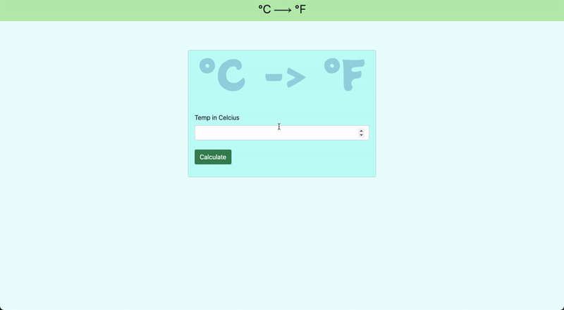

# TempCon

## What is this

It is a temperature convertor made using javascript, HTML, CSS and BootStrap.



---

## Setup

Open terminal and navigate to the project directory, Then execute the following command.

```sh
# Run npm install to install all the dependencies

npm install
```

And then Just open it in the browser.

## Enjoy your powerfull application
